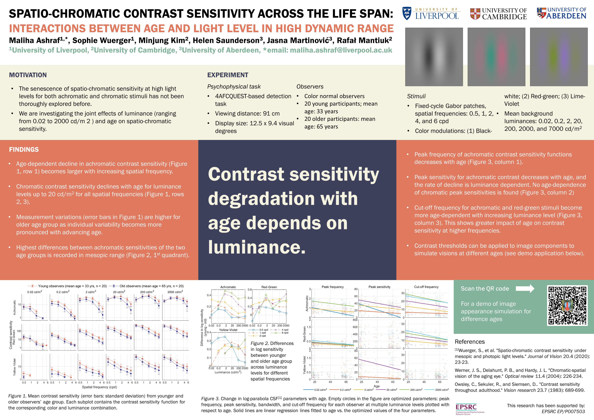

  

      <ul class="nav">  
          <li><a href="https://github.com/MalihaAshraf">github</a></li>
		  <li><a href="https://www.linkedin.com/in/malihaashraf/">linkedin</a></li>
		  <li><a href="https://twitter.com/MalihaA5hraf">@malihaa5hraf</a></li>
      </ul>
  

	<h4>highlights</h4>
	   

<!--<h4>Recent Publication</h4>-->

    

        

            
        

        

        <b>Spatio-chromatic contrast sensitivity under mesopic and photopic light levels</b> 
		Wuerger, S., Ashraf, M., Kim, M., Martinovic, J., Pérez-Ortiz, M., & Mantiuk, R. K. (April, 2020). <i>Journal of Vision</i>, Vol. 20, 23. doi: <a href="https://jov.arvojournals.org/article.aspx?articleid=2765519">https://doi.org/10.1167/jov.20.4.23</a>
        

    

<!--<h4>Recent Conference Poster</h4>-->
	<b>Poster presented at Virtual VSS 2020, June 19-24</b>  
	

		

		

		

			
		

	

	

		

		
			
		

		

			Site design from <a href="https://kbroman.org/simple_site/pages/user_site.html">Tutorial: Making a personal site</a>.
		

	

