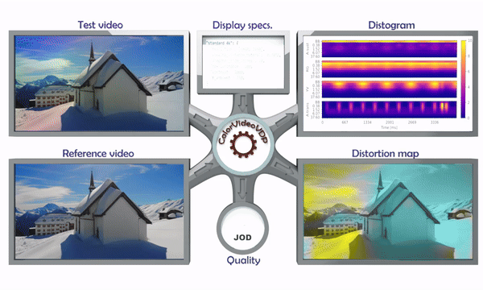
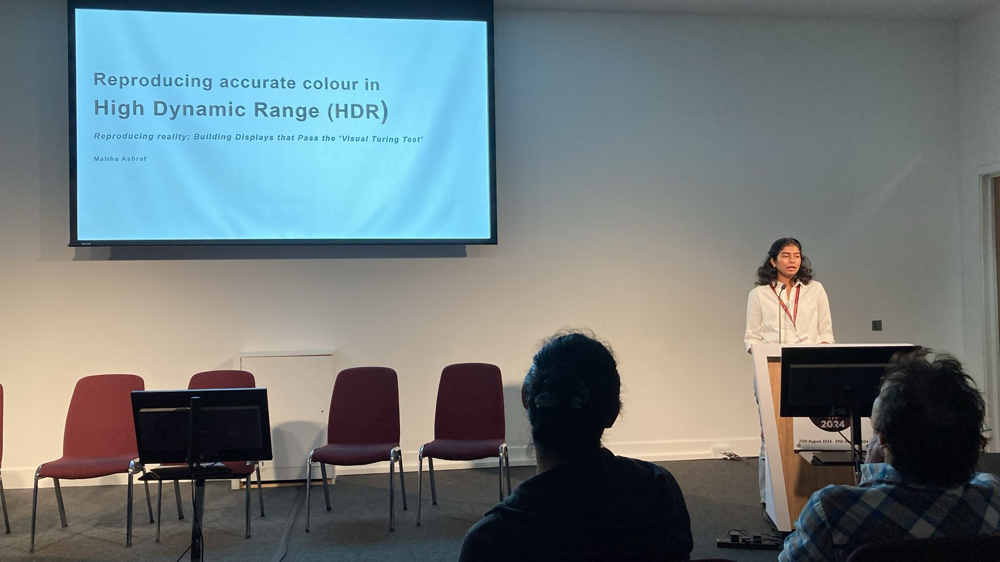
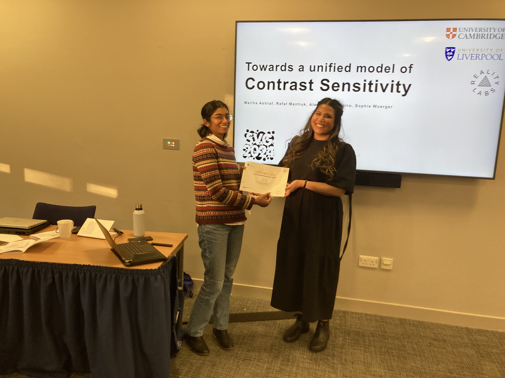

    

		

        
				   
        

        

			I am a researcher trained in electronic engineering, colour science, and psychophysics with a strong interest in visual perception. My work focuses on understanding how humans process contrast, colour, and detail, with applications in image processing, display technology, and human-computer interaction.
			 			 
			<!--<strong>PhD student</strong> at <a href="https://www.liverpool.ac.uk/">University of Liverpool</a> supervised by <a href="https://www.liverpool.ac.uk/electrical-engineering-and-electronics/staff/jeremy-smith/">Jeremy Smith</a> and <a href="https://pcwww.liv.ac.uk/~sophiew/">Sophie Wuerger</a> 
             
			<strong>Email:</strong>
			ma905 (at) cam (dot) ac (dot) (uk)-->
			 
        

        
    

	

		

			I completed my PhD at <a href="https://www.liverpool.ac.uk/">University of Liverpool</a>, supervised by Prof. Sophie Wuerger and Prof. Jeremy Smith, in 2024, where I measured and modelled human contrast vision. Before that, I earned my master's in <a href="https://cosi-master.eu/">Colour Science</a> via an <a href="https://ec.europa.eu/programmes/erasmus-plus/opportunities/individuals/students/erasmus-mundus-joint-master-degrees_en">Erasmus Mundus Joint Master Degree (EMJMD) Program</a>. More recently, I have worked as a postdoctoral researcher in <a href="https://www.cl.cam.ac.uk/~rkm38/">Prof. Rafał Mantiuk</a>'s group at <a href="https://www.cst.cam.ac.uk/">University of Cambridge</a> (funded by <a href="https://about.meta.com/realitylabs/">Reality Labs</a>).
			  
			After finishing my postdoc, I decided to take a break to travel and wrap up previous projects before figuring out my next step. I am now looking for a role that is exciting, intellectually stimulating, and makes good use of my skills. 
			 
		

	

  

      <ul class="nav">  
		  <li><a href="https://scholar.google.com/citations?user=9Jl9K3wAAAAJ&hl=en">Google Scholar</a></li>
		  <li><a href="https://www.researchgate.net/profile/Maliha_Ashraf4">Research Gate</a></li>
		  <li><a href="https://orcid.org/0000-0002-8142-5611">ORCiD</a></li>
          <li><a href="https://github.com/MalihaAshraf">GitHub</a></li>
		  <li><a href="https://www.linkedin.com/in/malihaashraf/">LinkedIn</a></li>
		  <li><a href="https://twitter.com/MalihaA5hraf">@malihaa5hraf</a></li>
      </ul>
  

	<h3>projects</h3>

    <b><a href="/pages/hvs.html">Human contrast vision</a></b>  
    

        

			
		

		

           We have conducted a series of studies investigating human visual perception, specifically focusing on contrast sensitivity. This research examines how various factors such as luminance, spatial and temporal frequencies, color space modulation, and stimulus area influence our ability to detect contrast. By measuring human visual system responses to diverse stimuli and integrating data from multiple studies, we have developed robust models that predict human visual performance under a wide range of conditions.  
        
 
	
 

    <b><a href="/pages/metrics.html">Perceptual visual quality metrics</a></b>  
    

        

			
		

		

            The work under this project focuses on developing perceptual metrics for evaluating image and video quality. Through the development of visual difference predictors, comprehensive datasets for extended reality environments, and detailed models, we aim to predict human visual performance and perceptual quality across diverse conditions, supporting the evaluation of digital content and display technologies.   
        
 
	
 

    <b><a href="/pages/colour.html">Colour correction and calibration</a></b>  
    

        

			
		

		

            This series of work focuses on advancing colour calibration methods across various devices and media. We have explored a range of techniques, including classical methods and neural networks, for improving colour accuracy and consistency. It examines how exposure levels, luminance, and colour space modulation affect colour correction. Through evaluations and comparisons, these studies aim to develop models and techniques towards precise colour calibration for displays and imaging systems.  
        
 
	
 

    <b><a href="/pages/misc.html">Miscellaneous projects</a></b> 

	<h3>news</h3>

    <b>October 2024: Speaking at <a href="https://www.imaging.org/IST/IST/Conferences/CIC/CIC2024/CIC_Home.aspx" target="_blank">CIC32</a> in Montreal</b>  
    
		
        

            I am giving a talk at CIC (Color & Imaging Conference) in Montreal on Thursday, 31st October, 2024. The title of the talk is "Modelling Contrast Matching Across Luminance Levels".  
        
 
	
 

    <b>August 2024: Attended <a href="https://ecvp2024.abdn.ac.uk/" target="_blank">ECVP</a> in Aberdeen</b>  
    
		
        

            I attended the ECVP (European Conference on Visual Perception) conference in Aberdeen from 25th - 29th August, 2024. I gave two talks in the symposia; <a href="https://ecvp2024.abdn.ac.uk/symposia/">Reproducing Reality: What is needed to build displays that pass the “Visual Turing Test”?</a> and <a href="https://ecvp2024.abdn.ac.uk/symposia/">Spanning the space of science: From cones to colour applications. A symposium in honour of Sophie Wuerger</a>.  
        
 
	
 
	
	
		
	
		
		
		

			
		
  
	
 

    
		
        

		<b>July 2024: Graduated!</b>  
        Thesis: <a href="https://doi.org/10.17638/03182202" target="_blank">
		Perceptually-based Modelling of Human Contrast Vision</a>  
        
   
		

           
		

	
 

    
		
        

		<b>March 2024: <a href="https://stirlingperception.stir.ac.uk/svg2024/programme/" target="_blank">ECR Prize at the Scottish Vision Group Meeting</a></b>  
        I received the Early Career Researcher (ECR) prize at the Scottish Vision Group (SVG) meeting in and presented my work titled: <em>Towards a Unified Model of Contrast Sensitivity</em>  
        
   
		

            
		
       
	
 

<!--

	<h3>highlights</h3>

    <b>November 2023: Attended <a href="https://www.imaging.org/IST/Conferences/CIC/CIC2023/CIC_Home.aspx?hkey=2b9f077c-88d0-4baa-b55f-98ed886aba94&WebsiteKey=6d978a6f-475d-46cc-bcf2-7a9e3d5f8f82&8a93a38c6b0c=7#8a93a38c6b0c">CIC31</a> held in Paris</b>  
    
		
        

            I was one of the short course chairs along with Hong Wei, and also a session chair for the "Multi- and Hyperspectral" technical session. Our poster <em>"Forward and inverse color calibration models for OLED displays"</em> garnered a lot of interest.   
        
   
		

            
		

        
	
 

 -->

<footer class="text-muted">
  

    

      <a class="text-info" href="#top">Back to top</a>
    

    
© Maliha Ashraf 2023

    
Inspired by <a href="https://kbroman.org/" class="text-info" target="_blank"> Karl Broman's website </a> 

  

</footer>

