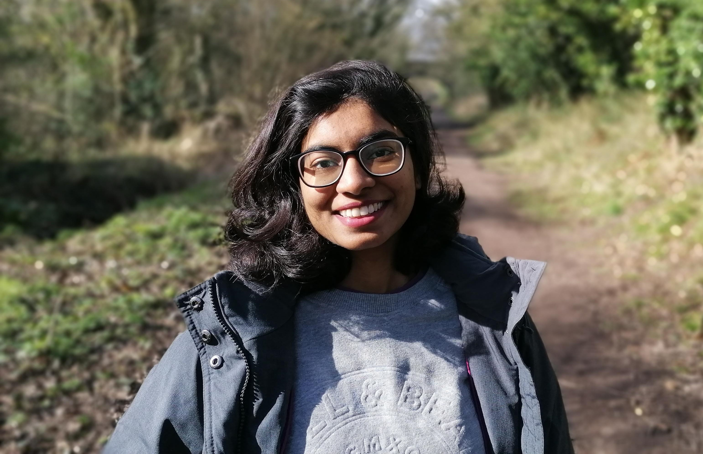

### education

**University of Liverpool** 
*PhD candidate (2019 - present)* 

	

		<i>Supervisors: 
		Topic: </i>
	

	

		<a href="https://www.liverpool.ac.uk/electrical-engineering-and-electronics/staff/jeremy-smith/">Jeremy Smith</a>, <a href="https://pcwww.liv.ac.uk/~sophiew/">Sophie Wuerger</a> 
		A spatio-chromatic colour appearance model for
		retargeting high dynamic range (HDR) image
		appearance across viewing conditions
	

 

**Université Jean Monnet** 
*Master of Science (2016 - 2018)* 

	

		<i>Awarding body: 
		Consortium:  
		Subject: 
		Thesis:</i>
	

	

		<a href="https://ec.europa.eu/programmes/erasmus-plus/opportunities/individuals/students/erasmus-mundus-joint-master-degrees_en">Erasmus Mundus Joint Master Degree (EMJMD) Program</a> 
		Universidad de Granada, University of Eastern Finland, Norwegian University of Science and Technology 
		<a href="https://cosi-master.eu/">COSI</a> (Color in Science and Industry) 
		Development of a high-fidelity color calibration framework
	

 

**NED University of Engineering and Technology** 
*Bachelor of Engineering (2012 - 2016)* 

	

		<i>Subject: 
		Project:</i>
	

	

		Electronic Engineering  
		Biomedical wireless sensor network for remote patient care
	

 

<!-- Supervisors: [Prof. Jeremy Smith](https://www.liverpool.ac.uk/electrical-engineering-and-electronics/staff/jeremy-smith/), [Prof. Sophie Wuerger](https://pcwww.liv.ac.uk/~sophiew/) 
Topic: A spatio-chromatic colour appearance model for
retargeting high dynamic range (HDR) image
appearance across viewing conditions

##### MS in Color Sciences (2016 - 2018)
[COSI](https://cosi-master.eu/scholarships/), Erasmus Mundus Joint Master Degree 
##### BE in Electronic Engineering (2012 - 2016)
NED University of Engineering & Technology    -->

### experience

**University of Liverpool** 
*Research assistant (Jan 2019 - present)* 
[Sophie Wuerger](https://pcwww.liv.ac.uk/~sophiew/) 
Designs and conducts psychophysical experiments using a prototype high dynamic range display. Responsible for data collection, analysis, and modelling to predict stimuli appearance (chromatic and achromatic contrast) for a wide range of luminance levels.   

**University of Cambridge** 
*Visiting researcher (Aug 2019 - Sep 2019)* 
[Rafał Mantiuk](https://www.cl.cam.ac.uk/~rkm38/), [Minjung Kim](https://www.minjung.ca/) 
Received training in calibrating and operating a custom-made HDR (high dynamic range) display. Assisted in collecting data from psychophysical experiments.   

**Océ - A Canon Company** 
*Research intern (Feb 2018 - Aug 2018)* 
[Ricardo Sapaico](https://www.researchgate.net/profile/Ricardo_Sapaico) 
Developed a high-fidelity color calibration framework for 2D and 3D image acquisition devices as part of my master thesis. Developed methods for geometric, color, and radiometric characterization and calibration of imaging devices.   

**Olympus Corporation** 
*Research intern (Jul 2017 - Aug 2017)* 
[Joji Sakamoto](https://www.linkedin.com/in/joji-sakamoto-73b9b368/?originalSubdomain=fi) 
Imaging Technology Department (Hachioji, Japan).
Developed a pipeline for spectral design and development of optimum illuminants for contrast enhancement   

### awards

**WD Wright Award** 
*June 2020* 
Colour Vision Group of Great Britain (Travel Award)  

**Erasmus Mundus Scholarship** 
*Sep 2016 - Aug 2018* 
EU-funded full scholarship grant  

**Gold medal** 
*Mar 2016* 
First position academic merit award  

 
[orcid](https://orcid.org): [0000-0002-8142-5611](https://orcid.org/0000-0002-8142-5611) 
[google scholar](https://scholar.google.com/citations?user=9Jl9K3wAAAAJ&hl=en) 
<!-- [impactstory](https://impactstory.org/u/0000-0002-4914-6671)  -->
[github](https://github.com/MalihaAshraf) 
she/her

---

<h4>contact</h4>

    

        

            Maliha Ashraf 
            <a href="https://www.liverpool.ac.uk/institute-of-life-and-human-sciences/schools-and-departments/department-of-psychological-sciences/">Department of Psychological Sciences</a> 
            <a href="https://www.liverpool.ac.uk/">University of Liverpool</a> 
            Eleanor Rathbone Building 
            Liverpool, L69 7ZA 
            UK  

            maliha.ashraf@liverpool.ac.uk
        

        

        
        

    

