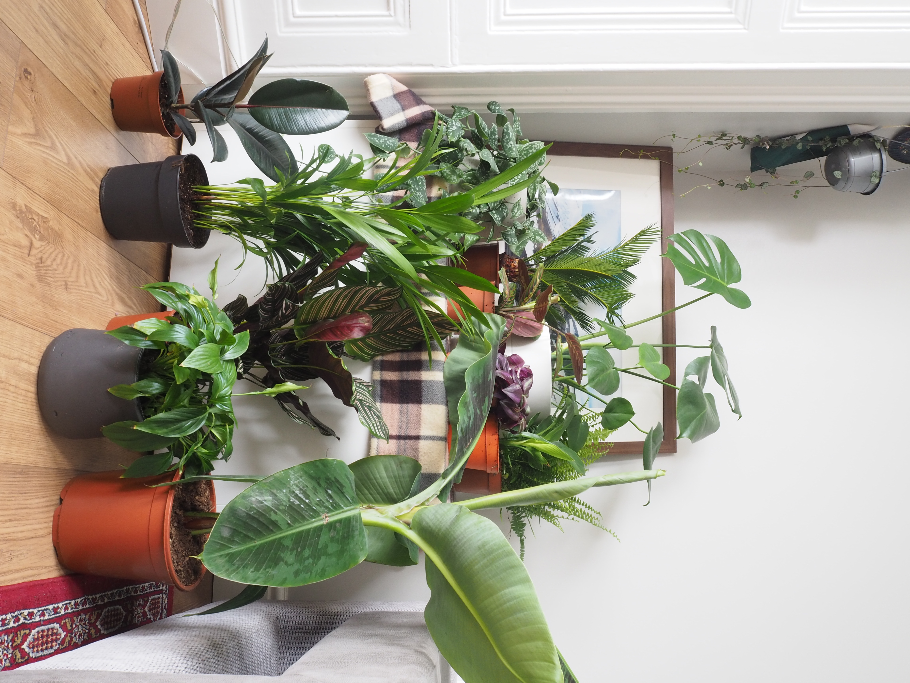
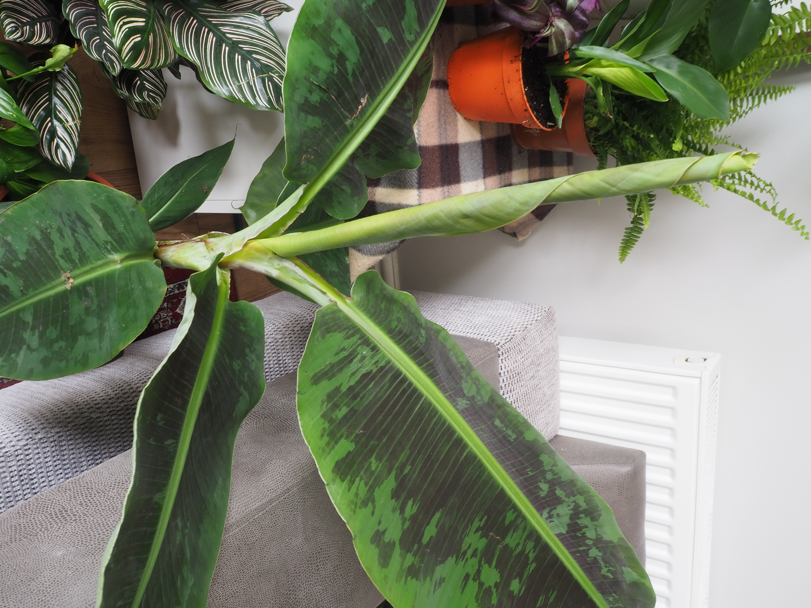
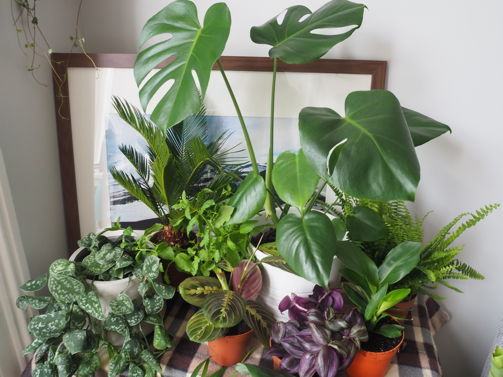
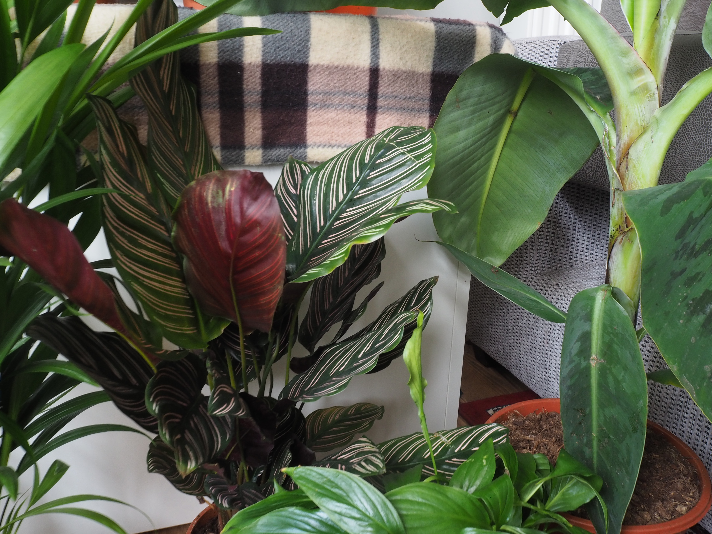
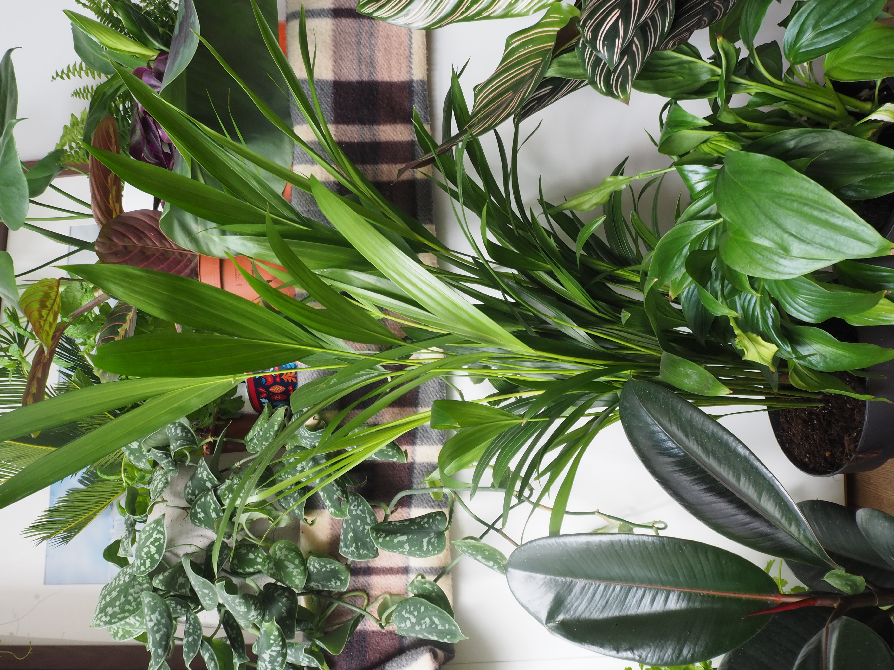
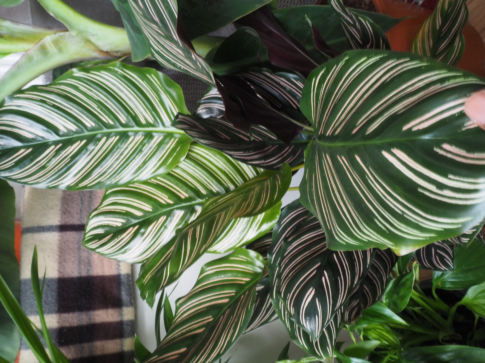

	<b>botanic adventures</b>  
	

		

			This started as a lockdown coping mechanism but I might have taken it a tad too far. 
		

		
		
		
		
 

		
		
		
		<!--

			
		

		

			
		

		

			
		

		

			 
		
-->
	

