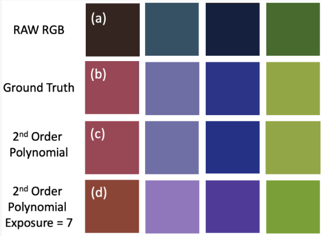
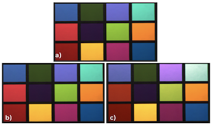
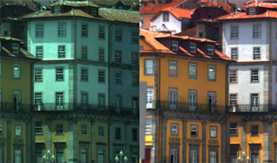
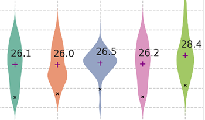
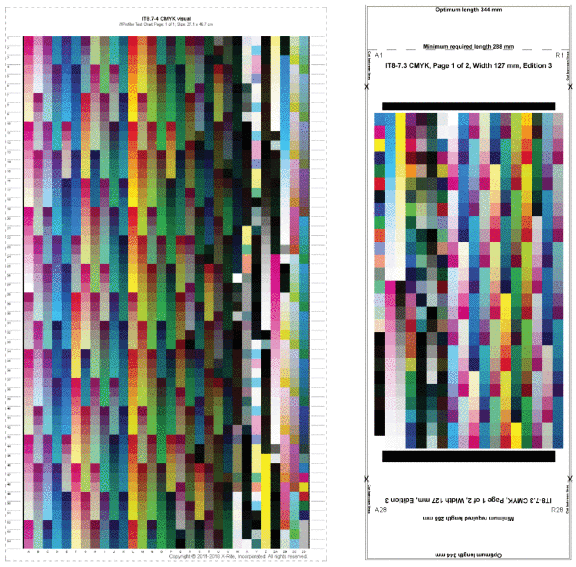

  

      <ul class="nav">  
		  <li><a href="hvs.html">Human contrast vision</a></li>
		  <li><a href="metrics.html">Perceptual visual quality metrics</a></li>
		  <!-- <li><a href="colour.html">Colour correction and calibration</a></li>-->
		  <li><a href="misc.html">Miscellaneous projects</a></li>
      </ul>
  

### Colour correction and calibration

    

        

			
		

		

		<b><a href="https://library.imaging.org/ei/articles/36/16/COLOR-166" target="_blank">Color Calibration Methods For OLED Displays</a></b> 
		Maliha Ashraf, Alejandro Sztrajman, Dounia Hammou, Rafał K. Mantiuk 
		<i>COLOR—Color Imaging: Displaying, Processing, Hardcopy, and Applications Conference (2024)</i>
		<a href="citations/ashraf2024color.txt" target="_blank"><i class="fa-solid fa-quote-right" style="font-size:16px; margin-left: 10px;"></i></a>
		  		
          Accurate color reproduction on a display requires an inverse display model, mapping colorimetric values (e.g. CIE XYZ) into RGB values driving the display. To create such a model, we collected a large dataset of display color measurements for a high refresh-rate 4-primary OLED display. We demonstrated that, unlike traditional LCD displays, multi-primary OLED display color responses are non-additive and non-linear for some colors. We tested the performances of different regression methods: polynomial regression, look-up tables, multi-layer perceptrons, and others. The best-performing models were additionally validated on newly measured (unseen) test colors. We found that the performances of several variations of 4th-degree polynomial models were comparable to the look-up table and machine-learning-based models while being less resource-intensive.  
        
 
	
 

    

        

			
		

		

		<b><a href="https://www.mdpi.com/2313-433X/9/10/214" target="_blank">Performance Comparison of Classical Methods and Neural Networks for Colour Correction
		</a></b> 
		Abdullah Kucuk, Graham D. Finlayson, Rafał K. Mantiuk, Maliha Ashraf 
		<i>Journal of Imaging (2023)</i>
		<a href="citations/kucuk2023performance.txt" target="_blank"><i class="fa-solid fa-quote-right" style="font-size:16px; margin-left: 10px;"></i></a>
		  		
          Colour correction is the process of converting RAW RGB pixel values of digital cameras to a standard colour space such as CIE XYZ. A range of regression methods including linear, polynomial and root-polynomial least-squares have been deployed. However, in recent years, various neural network (NN) models have also started to appear in the literature as an alternative to classical methods. In the first part of this paper, a leading neural network approach is compared and contrasted with regression methods. We find that, although the neural network model supports improved colour correction compared with simple least-squares regression, it performs less well than the more advanced root-polynomial regression. Moreover, the relative improvement afforded by NNs, compared to linear least-squares, is diminished when the regression methods are adapted to minimise a perceptual colour error. Problematically, unlike linear and root-polynomial regressions, the NN approach is tied to a fixed exposure (and when exposure changes, the afforded colour correction can be quite poor). We explore two solutions that make NNs more exposure-invariant. First, we use data augmentation to train the NN for a range of typical exposures and second, we propose a new NN architecture which, by construction, is exposure-invariant. Finally, we look into how the performance of these algorithms is influenced when models are trained and tested on different datasets. As expected, the performance of all methods drops when tested with completely different datasets. However, we noticed that the regression methods still outperform the NNs in terms of colour correction, even though the relative performance of the regression methods does change based on the train and test datasets.
  
        
 
	
 

    

        

			
		

		

		<b><a href="https://library.imaging.org/cic/articles/30/1/31" target="_blank">An Exposure Invariant Neural Network for Colour Correction</a></b> 
		Abdullah Kucuk, Graham D. Finlayson, Rafał K. Mantiuk, Maliha Ashraf 
		<i>CIC—Color and Imaging Conference (2022)</i>
		<a href="citations/kucuk2022exposure.txt" target="_blank"><i class="fa-solid fa-quote-right" style="font-size:16px; margin-left: 10px;"></i></a>
		  		
           Colour correction is the process of converting camera dependent RGB values to a camera independent standard colour space such as CIE XYZ. Regression methods — linear, polynomial, and root-polynomial least-squares — are traditionally used to solve for the colour correction transform. More recently neural net solutions for colour correction have been developed. This paper begins with the observation that the neural net solution — while delivering better colour correction accuracy compared to the simple (and widely deployed) 3×3 linear correction matrix approach — is not exposure invariant. That is to say, the network is tuned to mapping RGBs to XYZs for a fixed exposure level and when this exposure level changes, its performance degrades (and it delivers less accurate colour correction compared to the 3x3 matrix approach which is exposure invariant). We develop two remedies to the exposure variation problem. First, we augment the data we use to train the network to include responses for many different exposures. Concomitantly, the trained network is robust to a changing exposure. Second, we redesign the network so, by construction, it is exposure invariant. Experiments demonstrate that, by adopting either approach, Neural Network colour correction can be made exposure invariant.  
        
 
	
 

    

        

			
		

		

		<b><a href="https://library.imaging.org/lim/articles/3/1/17" target="_blank">Comparison of Regression Methods and Neural Networks for Colour Corrections</a></b> 
		Abdullah Kucuk, Graham D. Finlayson, Rafał K. Mantiuk, Maliha Ashraf 
		<i>LIM—London Imaging Meeting (2022)</i>
		<a href="citations/kucuk2022comparison.txt" target="_blank"><i class="fa-solid fa-quote-right" style="font-size:16px; margin-left: 10px;"></i></a>
		  			
           Colour correction is the problem of mapping the sensor responses measured by a camera to the display-encoded RGBs or to a standard colour space such as CIE XYZ. In regression-based colour correction, camera RAW RGBs are mapped according to a simple formula (e.g. a linear mapping). Regression methods include least squares, polynomial and root-polynomial approaches. More recently, researchers have begun to investigate how neural networks can be used to solve the colour correction problem. _x005F_x000D_ _x005F_x000D_ In this paper, we investigate the relative performance of regression versus a neural network approach. While we find that the latter approach performs better than simple least-squares the performance is not as good as that delivered by either root-polynomial or polynomial regression. The root-polynomial approach has the advantage that it is also exposure invariant. In contrast, the Neural Network approach delivers poor colour correction when the exposure changes.  
        
 
	
 

    

        

			
		

		

		<b><a href="https://library.imaging.org/lim/articles/3/1/18" target="_blank">Colour Difference Formula for Photopic and Mesopic Vision Incorporating Cone and Rod Responses</a></b> 
		Maliha Ashraf, Rafał K. Mantiuk, Graham D. Finlayson, Abdullah Kucuk, Sophie Wuerger 
		<i>LIM—London Imaging Meeting (2022)</i>
		<a href="citations/ashraf2023colour.txt" target="_blank"><i class="fa-solid fa-quote-right" style="font-size:16px; margin-left: 10px;"></i></a>
		  			
           The standard colour difference formulas, such as CIEDE2000, operate on colours defined by cone-fundamentals, which ignore the influence of rods on colour perception. In this work, we combine the rod intrusion model by Cao et al. with the popular CIEDE2000 colour difference formula and validate the accuracy of the new formula on three contrast sensitivity datasets. When compared with the standard CIEDE2000 formula, the new colour difference formula improves the perceptual uniformity of the space at low luminance levels.  
        
 
	
 

    

        

			
		

		

		<b><a href="https://ieeexplore.ieee.org/document/8496542" target="_blank">Evaluation of Color Correction Methods for Printed Surfaces</a></b> 
		Maliha Ashraf, Luis Ricardo Sapaico 
		<i>CVCS—Colour and Visual Computing Symposium (2018)</i>
		<a href="citations/ashraf2018evaluation.txt" target="_blank"><i class="fa-solid fa-quote-right" style="font-size:16px; margin-left: 10px;"></i></a>
		  				
           Achieving truthful reproduction of color is a well-known problem for printing applications. In this paper, we evaluate different methods for camera color calibration, within the scope of a moving image acquisition system. The acquisition device consists of a RGB camera and two fixed tungsten lamps. Our goal is to determine the most robust end-to-end framework given the acquisition conditions. We tested some color mapping methods commonly mentioned in the literature and made modifications to our specific needs. Our modified 3D lookup table (LUT) based method performs the best in the given conditions with future possibilities of hybrid LUTs combining the best performing aspects of different types of LUTs.  
        
 
	
 

<!-- 

	

		

			
			<b>Retinal illuminance is reduced with age</b>
			
			
			   <b>CSF of older adults match CSF of younger adults at lower luminances</b>
			
		

	

-->