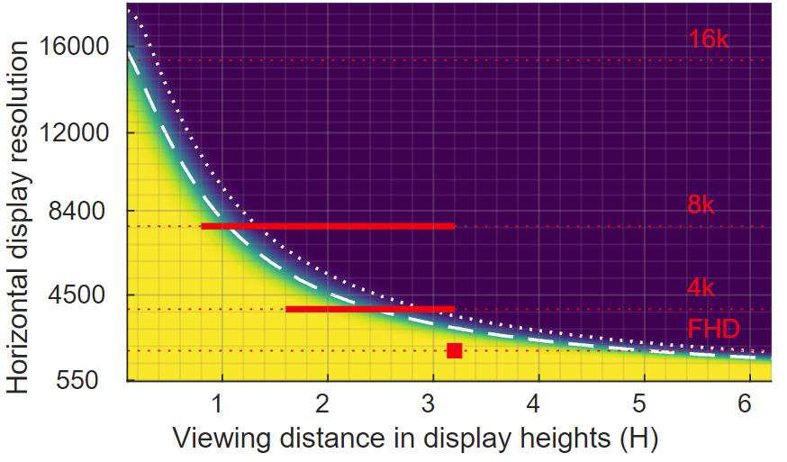
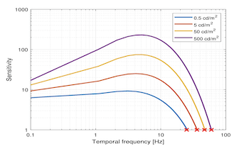
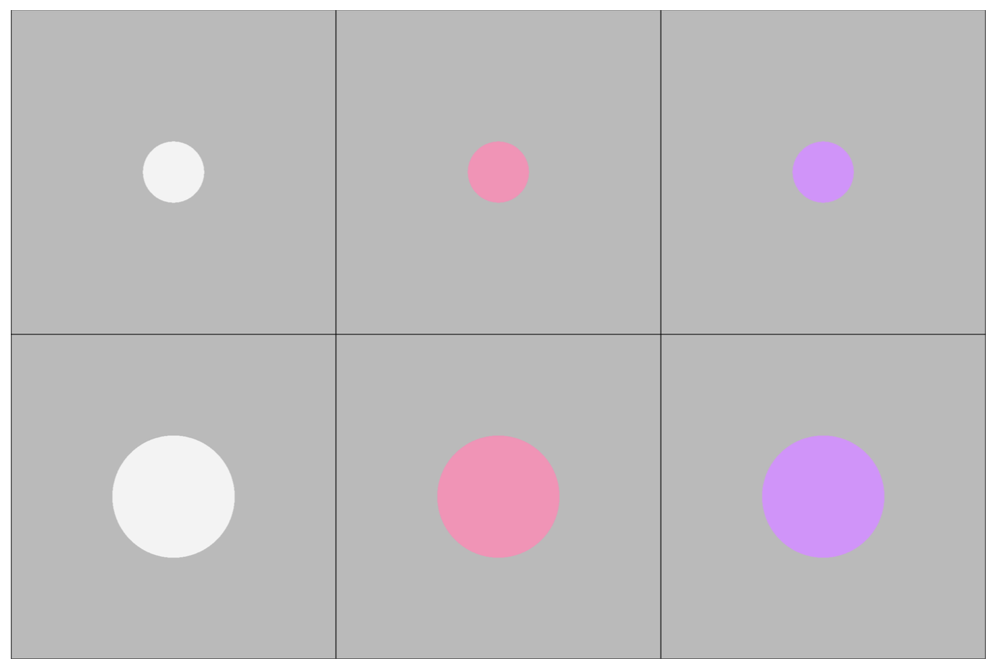
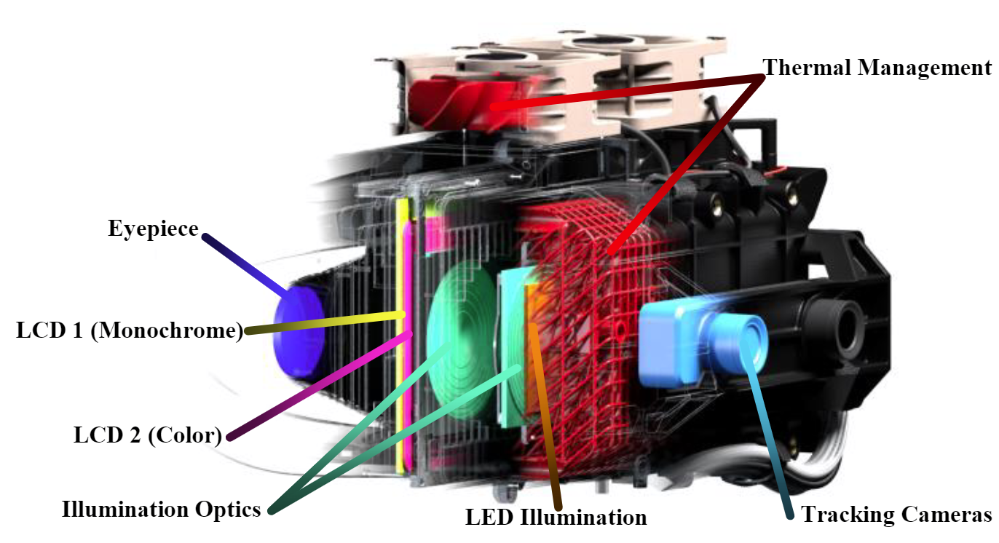
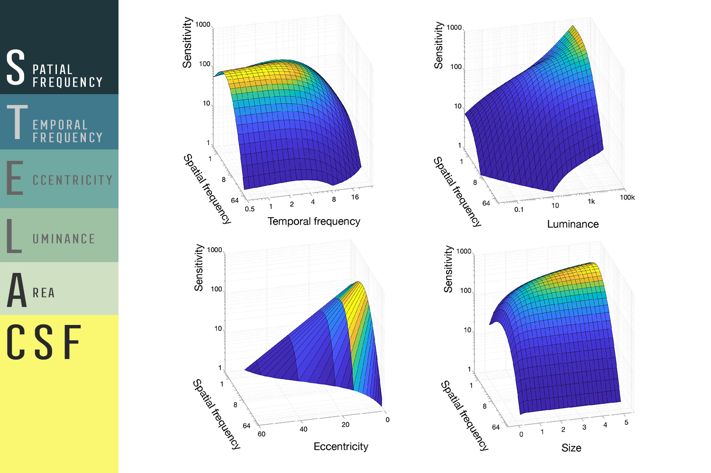
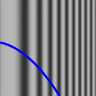
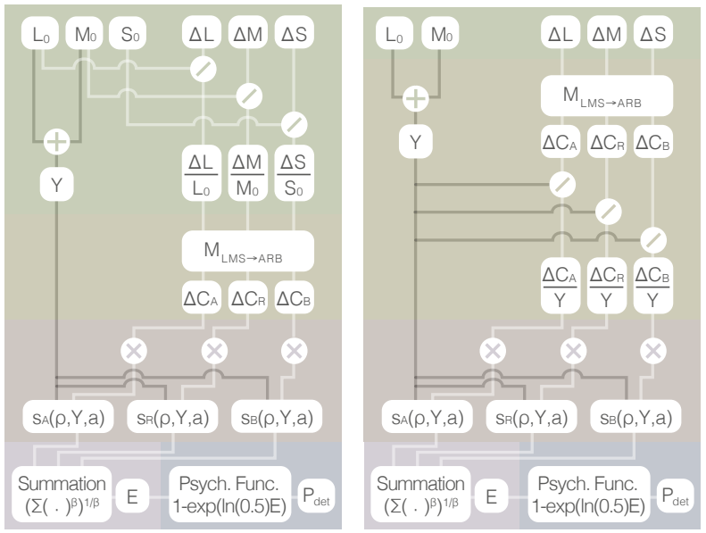
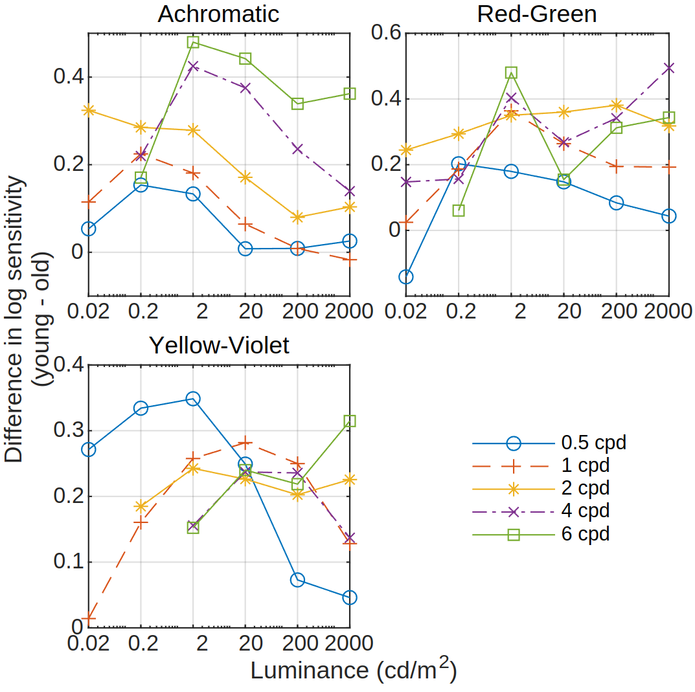
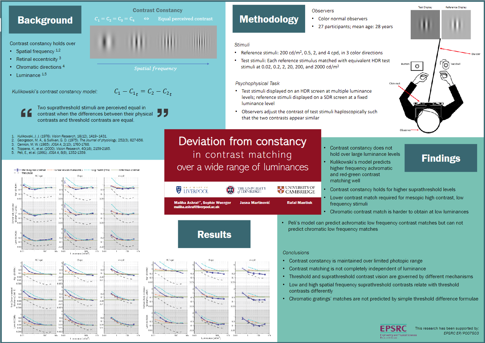
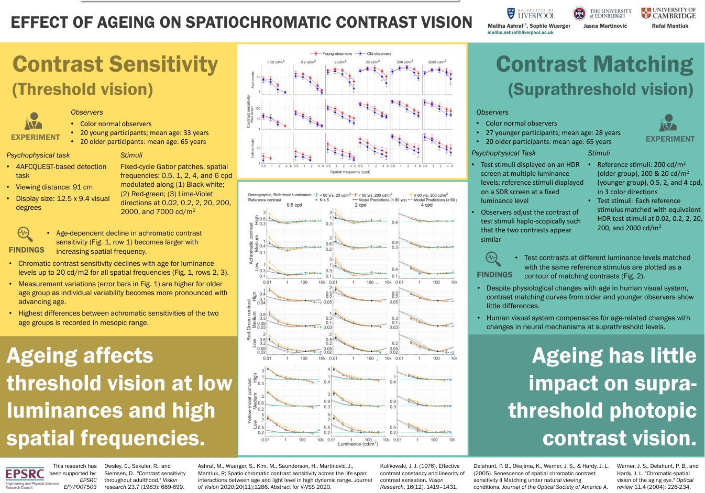

  

      <ul class="nav">  
		  <!-- <li><a href="hvs.html">Human contrast vision</a></li>-->
		  <li><a href="metrics.html">Perceptual visual quality metrics</a></li>
		  <li><a href="colour.html">Colour correction and calibration</a></li>
		  <li><a href="misc.html">Miscellaneous projects</a></li>
      </ul>
  

### human contrast vision

    

		

			
		

		

			<b><a href="https://arxiv.org/abs/2410.06068" target="_blank">Resolution limit of the eye: how many pixels can we see?</a></b> 
			Maliha Ashraf, Alexandre Chapiro, Rafał K. Mantiuk  	
			<i>arXiv preprint (2024)</i>
			<a href="citations/ashraf2024resolution.txt" target="_blank"><i class="fa-solid fa-quote-right" style="font-size:16px; margin-left: 10px;"></i></a>
			<a href="https://www.cl.cam.ac.uk/research/rainbow/projects/display_calc/" target="_blank"><i class="fa-solid fa-globe" style="font-size:16px; margin-left: 10px;"></i></a>
			 
			 
			As large engineering efforts go towards improving the resolution of mobile, AR and VR displays, it is important to know the maximum resolution at which further improvements bring no noticeable benefit. This limit is often referred to as the "retinal resolution", although the limiting factor may not necessarily be attributed to the retina. To determine the ultimate resolution at which an image appears sharp to our eyes with no perceivable blur, we created an experimental setup with a sliding display, which allows for continuous control of the resolution. The lack of such control was the main limitation of the previous studies. We measure achromatic (black-white) and chromatic (red-green and yellow-violet) resolution limits for foveal vision, and at two eccentricities (10 and 20 deg). Our results demonstrate that the resolution limit is higher than what was previously believed, reaching 94 pixels-per-degree (ppd) for foveal achromatic vision, 89 ppd for red-green patterns, and 53 ppd for yellow-violet patterns. We also observe a much larger drop in the resolution limit for chromatic patterns (red-green and yellow-violet) than for achromatic. Our results set the north star for display development, with implications for future imaging, rendering and video coding technologies.
		
 
	
 

    

        

			
		

		

		<b><a href="https://jov.arvojournals.org/article.aspx?articleid=2793530" target="_blank">castleCSF — A contrast sensitivity function of color, area, spatiotemporal frequency, luminance and eccentricity</a></b> 
		Maliha Ashraf, Rafał K. Mantiuk, Alexandre Chapiro, Sophie Wuerger
		 		
		<i>Journal of Vision (2024)</i>
		<a href="citations/ashraf2024castlecsf.txt" target="_blank"><i class="fa-solid fa-quote-right" style="font-size:16px; margin-left: 10px;"></i></a>
		<a href="https://github.com/gfxdisp/castleCSF" target="_blank"><i class="fa-brands fa-github" style="font-size:16px; margin-left: 10px;"></i></a>
		<a href="https://www.cl.cam.ac.uk/research/rainbow/projects/castleCSF/" target="_blank"><i class="fa-solid fa-globe" style="font-size:16px; margin-left: 10px;"></i></a>
		 
		 
           The contrast sensitivity function (CSF) is a fundamental visual model explaining our ability to detect small contrast patterns. CSFs found many applications in engineering, where they can be used to optimize a design for perceptual limits. To serve such a purpose, CSFs must explain possibly a complete set of stimulus parameters, such as spatial and temporal frequency, luminance, and others. Although numerous contrast sensitivity measurements can be found in the literature, none fully explains the complete space of stimulus parameters. Therefore, in this work, we first collect and consolidate contrast sensitivity measurements from 18 studies, which explain the sensitivity variation across the parameters of interest. Then, we build an analytical contrast sensitivity model that explains the data from all those studies. The proposed castleCSF model explains the sensitivity as the function of spatial and temporal frequencies, an arbitrary contrast modulation direction in the color space, mean luminance, and chromaticity of the background, eccentricity, and stimulus area. The proposed model uses the same set of parameters to explain the data from 18 studies with an error of 3.59 dB. The consolidated contrast sensitivity data and the code for the model are publicly available at the <a href="https://github.com/gfxdisp/castleCSF/">project website</a>.   
        
 
	
 

    

        

			
		

		

		<b><a href="https://library.imaging.org/ei/articles/36/11/HVEI-209" target="_blank">Spatiotemporal contrast sensitivity functions: predictions for the critical flicker frequency</a></b> 
		Ali Bozorgian, Maliha Ashraf, Rafał K. Mantiuk  
		<i>HVEI—Human Vision and Electronic Imaging Conference (2024)</i>
		<a href="citations/bozorgian2024spatiotemporal.txt" target="_blank"><i class="fa-solid fa-quote-right" style="font-size:16px; margin-left: 10px;"></i></a>
			 	
			 
           Contrast sensitivity functions (CSFs), which provide estimations of detection thresholds, have far-reaching applications in digital media processing, rendering, and transmission. There is a practical interest in obtaining accurate estimations of spatial and temporal resolution limits from a spatiotemporal CSF model. However, current spatiotemporal CSFs are inaccurate when predicting high-frequency limits such as critical flicker frequency (CFF). To address this problem, we modified two spatiotemporal CSFs, namely Barten’s CSF and stelaCSF, to better account for the contrast sensitivity at high temporal frequencies, both in the fovea and eccentricity. We trained these models using 15 datasets of spatial and temporal contrast sensitivity measurements from the literature. Our modifications account for two features observed in CFF measurement: the increase of CFF at medium eccentricities (of about 15 deg), and the saturation of CFF at high luminance values. As a result, the prediction errors for CFF obtained from the modified models improved remarkably.  
        
 
	
 

    

        

			
		

		

		<b><a href="https://library.imaging.org/ei/articles/35/10/HVEI-246" target="_blank">Modelling contrast sensitivity of discs</a></b> 
		Maliha Ashraf, Rafał K. Mantiuk, Alexandre Chapiro 
		<i>HVEI—Human Vision and Electronic Imaging Conference (2023)</i>
		<a href="citations/ashraf2023modelling.txt" target="_blank"><i class="fa-solid fa-quote-right" style="font-size:16px; margin-left: 10px;"></i></a>
		  		
           Spatial and temporal contrast sensitivity is typically measured using different stimuli. Gabor patterns are used to measure spatial contrast sensitivity and flickering discs are used for temporal contrast sensitivity. The data from both types of studies is difficult to compare as there is no well-established relationship between the sensitivity to disc and Gabor patterns. The goal of this work is to propose a model that can predict the contrast sensitivity of a disc using the more commonly available data and models for Gabors. To that end, we measured the contrast sensitivity for discs of different sizes, shown at different luminance levels, and for both achromatic and chromatic (isoluminant) contrast. We used this data to compare 6 different models, each of which tested a different hypothesis on the detection and integration mechanisms of disc contrast. The results indicate that multiple detectors contribute to the perception of disc stimuli, and each can be modelled either using an energy model, or the peak spatial frequency of the contrast sensitivity function.  
        
 
	
 

    

        

			
		

		

		<b><a href="https://library.imaging.org/ei/articles/35/10/HVEI-223" target="_blank">Critical flicker frequency (CFF) at high luminance levels
			</a></b> 
			Alexandre Chapiro, Nathan Matsuda, Maliha Ashraf,  Rafał K. Mantiuk 
			<i>HVEI—Human Vision and Electronic Imaging Conference (2023)</i>
			<a href="citations/chapiro2023critical.txt" target="_blank"><i class="fa-solid fa-quote-right" style="font-size:16px; margin-left: 10px;"></i></a>
			  		
           The critical flicker fusion (CFF) is the frequency of changes at which a temporally periodic light will begin to appear completely steady to an observer. This value is affected by several visual factors, such as the luminance of the stimulus or its location on the retina. With new high dynamic range (HDR) displays, operating at higher luminance levels, and virtual reality (VR) displays, presenting at wide fields-of-view, the effective CFF may change significantly from values expected for traditional presentation. In this work we use a prototype HDR VR display capable of luminances up to 20,000 cd/m^2 to gather a novel set of CFF measurements for never before examined levels of luminance, eccentricity, and size. Our data is useful to study the temporal behavior of the visual system at high luminance levels, as well as setting useful thresholds for display engineering.  
        
 
	
 

    

        

			
		

		

		<b><a href="https://library.imaging.org/cic/articles/30/1/38" target="_blank">Suprathreshold Contrast Matching between Different Luminance Levels</a></b> 
		Maliha Ashraf, Rafał K. Mantiuk, Jasna Martinovic, Sophie Wuerger 
		<i>CIC—Color and Imaging Conference (2022)</i>
		<a href="citations/ashraf2022suprathreshold.txt" target="_blank"><i class="fa-solid fa-quote-right" style="font-size:16px; margin-left: 10px;"></i></a>
		<a href="https://www.imaging.org/IST/Conferences/CIC/CIC2022/CIC_Home.aspx?8a93a38c6b0c=2#37" target="_blank"><i class="fa-solid fa-award" style="font-size:16px; margin-left: 10px;"></i></a>
		  		
           We investigated how perceived achromatic and chromatic contrast changes with luminance. The experiment consisted of test and reference displays viewed haploscopically, where each eye sees one of the displays. Test stimuli presented on the test display on a background of varying luminance levels (0.02, 2,20,200,2000 cd/m²) were matched in perceived contrast to reference stimuli presented on a background at a fixed 200 cd/m² luminance level. We found that approximate contrast constancy holds at photopic luminance levels (20 cd/m² and above), that is, test stimuli presented at these luminance backgrounds matched when their physical contrasts were the same magnitude as the reference stimulus for most conditions. For lower background luminances, covering an extensive range of 5 log units, much higher physical contrast was required to achieve a match with the reference. This deviation from constancy was larger for lower spatial frequencies and lower pedestal suprathreshold contrasts. Our data provides the basis for new contrast retargeting models for matching appearances across luminance levels.  
        
 
	
 

    

        

			
		

		

		<b><a href="https://dl.acm.org/doi/10.1145/3528223.3530115" target="_blank">stelaCSF: a unified model of contrast sensitivity as the function of spatio-temporal frequency, eccentricity, luminance and area</a></b> 
		Rafał K. Mantiuk, Maliha Ashraf, Alexandre Chapiro 
		<i>SIGGRAPH, ACM TOG—Transactions on Graphics (2022)</i>
		<a href="citations/mantiuk2022stelacsf.txt" target="_blank"><i class="fa-solid fa-quote-right" style="font-size:16px; margin-left: 10px;"></i></a>
		<a href="https://github.com/gfxdisp/stelaCSF" target="_blank"><i class="fa-brands fa-github" style="font-size:16px; margin-left: 10px;"></i></a>
		<a href="https://www.cl.cam.ac.uk/research/rainbow/projects/stelaCSF/" target="_blank"><i class="fa-solid fa-globe" style="font-size:16px; margin-left: 10px;"></i></a>
		  		
           A contrast sensitivity function, or CSF, is a cornerstone of many visual models. It explains whether a contrast pattern is visible to the human eye. The existing CSFs typically account for a subset of relevant dimensions describing a stimulus, limiting the use of such functions to either static or foveal content but not both. In this paper, we propose a unified CSF, stelaCSF, which accounts for all major dimensions of the stimulus: spatial and temporal frequency, eccentricity, luminance, and area. To model the 5-dimensional space of contrast sensitivity, we combined data from 11 papers, each of which studied a subset of this space. While previously proposed CSFs were fitted to a single dataset, stelaCSF can predict the data from all these studies using the same set of parameters. The predictions are accurate in the entire domain, including low frequencies. In addition, stelaCSF relies on psychophysical models and experimental evidence to explain the major interactions between the 5 dimensions of the CSF. We demonstrate the utility of our new CSF in a flicker detection metric and in foveated rendering.  
        
 
	
 

    

        

			
		

		

		<b><a href="https://jov.arvojournals.org/article.aspx?articleid=2765519" target="_blank">Spatio-chromatic contrast sensitivity under mesopic and photopic light levels</a></b> 
		Sophie Wuerger, Maliha Ashraf, Minjung Kim, Jasna Martinovic, María Pérez-Ortiz, Rafał K. Mantiuk 		
		<i>Journal of Vision (2020)</i>
		<a href="citations/wuerger2020spatio.txt" target="_blank"><i class="fa-solid fa-quote-right" style="font-size:16px; margin-left: 10px;"></i></a>
		<a href="https://github.com/MalihaAshraf/CSF_luminance_model" target="_blank"><i class="fa-brands fa-github" style="font-size:16px; margin-left: 10px;"></i></a>
		<a href="https://www.cl.cam.ac.uk/research/rainbow/projects/hdr-csf/" target="_blank"><i class="fa-solid fa-globe" style="font-size:16px; margin-left: 10px;"></i></a>
		<a href="https://www.repository.cam.ac.uk/items/d0fdf331-8bf5-4f2e-b6b9-d9ff077c9c21" target="_blank"><i class="fa-solid fa-file" style="font-size:16px; margin-left: 10px;"></i></a>
		 
		 
           Contrast sensitivity functions (CSFs) characterize the sensitivity of the human visual system at different spatial scales, but little is known as to how contrast sensitivity for achromatic and chromatic stimuli changes from a mesopic to a highly photopic range reflecting outdoor illumination levels. The purpose of our study was to further characterize the CSF by measuring both achromatic and chromatic sensitivities for background luminance levels from 0.02 cd/m2 to 7,000 cd/m2. Stimuli consisted of Gabor patches of different spatial frequencies and angular sizes, varying from 0.125 to 6 cpd, which were displayed on a custom high dynamic range (HDR) display with luminance levels up to 15,000 cd/m2. Contrast sensitivity was measured in three directions in color space, an achromatic direction, an isoluminant “red-green” direction, and an S-cone isolating “yellow-violet” direction, selected to isolate the luminance, L/M-cone opponent, and S-cone opponent pathways, respectively, of the early postreceptoral processing stages. Within each session, observers were fully adapted to the fixed background luminance (0.02, 2, 20, 200, 2,000, or 7,000 cd/m2). Our main finding is that the background luminance has a differential effect on achromatic contrast sensitivity compared to chromatic contrast sensitivity. The achromatic contrast sensitivity increases with higher background luminance up to 200 cd/m2 and then shows a sharp decline when background luminance is increased further. In contrast, the chromatic sensitivity curves do not show a significant sensitivity drop at higher luminance levels. We present a computational luminance-dependent model that predicts the CSF for achromatic and chromatic stimuli of arbitrary size.  
        
 
	
 

    

        

			
		

		

		<b><a href="https://library.imaging.org/cic/articles/28/1/art00002" target="_blank">Practical Color Contrast Sensitivity Functions for Luminance Levels up to 10000 cd/m2</a></b> 
		Rafał K. Mantiuk, Minjung Kim, Maliha Ashraf, Qiang Xu, M. Ronnier Luo, Jasna Martinovic, Sophie Wuerger 
		<i>CIC—Color and Imaging Conference (2020)</i>
		<a href="citations/mantiuk2020practical.txt" target="_blank"><i class="fa-solid fa-quote-right" style="font-size:16px; margin-left: 10px;"></i></a>
		<a href="https://github.com/gfxdisp/omni-csf" target="_blank"><i class="fa-brands fa-github" style="font-size:16px; margin-left: 10px;"></i></a>
		<i class="fa-solid fa-award" style="font-size:16px; margin-left: 10px;"></i>
		  		
           We model color contrast sensitivity for Gabor patches as a function of spatial frequency, luminance and chromacity of the background, modulation direction in the color space and stimulus size. To fit the model parameters, we combine the data from five independent datasets, which let us make predictions for background luminance levels between 0.0002 cd/m2 and 10 000 cd/m2, and for spatial frequencies between 0.06 cpd and 32 cpd. The data are well-explained by two models: A model that encodes cone contrast and a model that encodes postreceptoral, opponent-color contrast. Our intention is to create practical models, which can well explain the detection performance for natural viewing in a wide range of conditions. As our models are fitted to the data spanning very large range of luminance, they can find applications in modeling visual performance for high dynamic range and augmented reality displays.   
        
 
	
 

    

        

			
		

		

		<b><a href="https://library.imaging.org/cic/articles/28/1/art00011" target="_blank">Spatio-chromatic contrast sensitivity across the lifespan: interactions between age and light level in high dynamic range</a></b> 
		Maliha Ashraf, Sophie Wuerger, Minjung Kim, Jasna Martinovic, Rafał K. Mantiuk 
		<i>CIC—Color and Imaging Conference (2020)</i>
		<a href="citations/ashraf2020spatio.txt" target="_blank"><i class="fa-solid fa-quote-right" style="font-size:16px; margin-left: 10px;"></i></a>
		  		
         We investigated spatio-chromatic contrast sensitivity in both younger and older color-normal observers. We tested how the adapting light level affected the contrast sensitivity and whether there was a differential age-related change in sensitivity. Contrast sensitivity was measured along three directions in colour space (achromatic, red-green, yellowish-violet), at background luminance levels from 0.02 to 2000 cd/m2, and different stimuli sizes using 4AFC method on a high dynamic range display. 20 observers with a mean age of 33 y. o. a. and 20 older observers with mean age of 65 participated in the study. Within each session, observers were fully adapted to the fixed background luminance. Our main findings are: (1) Contrast sensitivity increases with background luminance up to around 200 cd/m2, then either declines in case of achromatic contrast sensitivity, or remains constant in case of chromatic contrast sensitivity; (2) The sensitivity of the younger age group is higher than that for the older age group by 0.3 log units on average. Only for the achromatic contrast sensitivity, the old age group shows a relatively larger decline in sensitivity for medium to high spatial frequencies at high photopic light levels; (3) Peak frequency, peak sensitivity and cut-off frequency of contrast sensitivity functions show decreasing trends with age and the rate of this decrease is dependent on mean luminance. The data is being modeled to predict contrast sensitivity as a function of age, luminance level, spatial frequency, and stimulus size.  
        
 
	
 

**posters**

    

        

					
		

		

		<b><a href="https://jov.arvojournals.org/article.aspx?articleid=2785016" target="_blank">Deviations from constancy in contrast matching over a wide range of luminances</a></b>  		
           The principle of contrast constancy in suprathreshold vision, first introduced by Georgeson and Sullivan (1975), stipulates that the perception of contrast remains invariant across different parameters of stimuli, including spatial frequency, size, retinal eccentricity, etc. Contrast constancy is also generally believed to hold over changes in luminance levels (Kulikowski, 1976; Peli, 1991), i.e., two stimuli with same physical contrast but different mean luminances will be perceived equal in contrast. However, the stimuli used in the studies investigating this kind of contrast matching varied within only 1 ~ 2.6 log units of luminance (cd/m^2). Modern high dynamic range (HDR) displays are capable of displaying content well over 1000 cd/m^2 and as low as 0.0001 cd/m^2. Our study aims to investigate whether contrast constancy also holds when the stimuli being matched vary across such large dynamic ranges. Our apparatus consisted of a reference and an HDR display, each visible to only one eye (haploscopic/dichoptic viewing). We used Gabor patches of 3 spatial frequencies (0.5, 1, and 4 cpd) with varying contrasts in achromatic and two chromatic directions. The reference display showed a reference stimulus at a fixed luminance level of 200 cd/m^2, whereas the HDR display showed similar test stimuli only varying in luminance levels ranging from 0.02 to 2,000 cd/m^2. Observers (n = 40) adjusted the contrast of the test stimuli until they perceived both reference and test contrasts to be the same. We found that contrast constancy does not hold over such a large range of luminance levels (5 log units). Stimuli over 20 cd/m^2 matched when their physical contrasts were the same for most conditions. But for lower luminances, much higher physical contrast was required for equal contrast perception. This deviation from constancy was also larger for lower spatial frequencies and lower pedestal suprathreshold contrasts.  
        
 
	
 

    

        

					
		

		

		<b><a href="https://jov.arvojournals.org/article.aspx?articleid=2777138#:~:text=Our%20results%20show%20that%20the,different%20factors%20than%20suprathreshold%20vision." target="_blank">Effect of age on threshold and suprathreshold contrast vision</a></b>  		
           The purpose of our study was to investigate the difference in spatio-chromatic contrast vision between younger (below 40) and older (above 60) colour-normal observers. We were particularly interested in how the adapting light level affected contrast vision and whether there was a differential age-related change in contrast threshold as well as suprathreshold contrast matching. There are two parts of the study, (i) contrast threshold measurement, (ii) suprathreshold contrast matching. In threshold measurement task, contrast sensitivity was measured for Gabor patches of 5 spatial frequencies (0.5, 1, 2, 4, and 6 cpd) in achromatic and two chromatic directions, at background luminance levels ranging from 0.02 to 10,000 cd/m^2. In the contrast matching task, a reference stimulus was displayed at a fixed luminance level and observers adjusted the contrast of the test stimulus displayed at different luminance levels (0.02 to 2000 cd/m^2). The matching experiment was repeated for 0.5, 2, and 4 cpd for all three colour directions at three suprathreshold levels of increasing contrast. Our main findings are: (1) Contrast sensitivity increases with background luminance up to around 200 cd/m2, then either declines in case of luminance contrast sensitivity, or becomes constant in case of chromatic contrast sensitivity; (2) The sensitivity of the younger age group is higher by ~0.3 log units; (3) Contrast sensitivity at higher spatial frequencies is more affected by ageing; (4) The differences between old and young group are not carried over to suprathreshold levels. Our results show that the effect of age on suprathreshold contrast matching is small in comparison to the age-related decline in contrast sensitivity (Mei et al, 2007) which is consistent with the hypothesis that contrast sensitivity at threshold is limited by different factors than suprathreshold vision.  
        
 
	
 

<!-- 

	

		

			
			<b>Retinal illuminance is reduced with age</b>
			
			
			   <b>CSF of older adults match CSF of younger adults at lower luminances</b>
			
		

	

-->