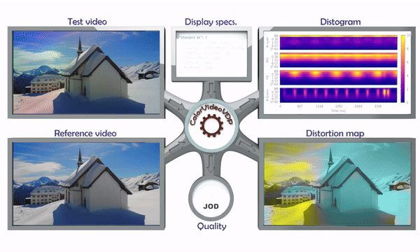
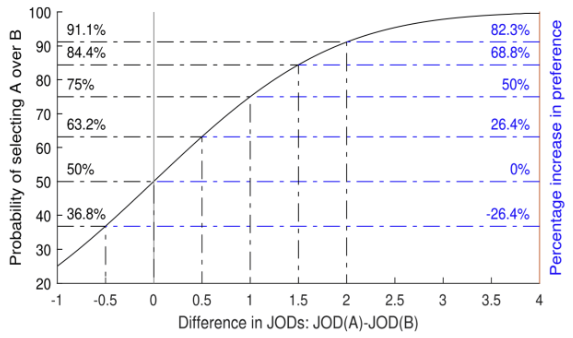
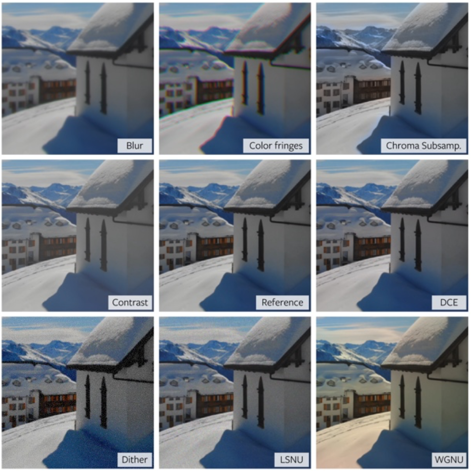
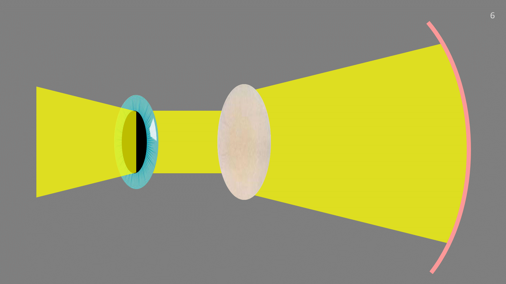

  

      <ul class="nav">  
		  <li><a href="hvs.html">Human contrast vision</a></li>
		  <!-- <li><a href="metrics.html">Perceptual visual quality metrics</a></li>-->
		  <li><a href="colour.html">Colour correction and calibration</a></li>
		  <li><a href="misc.html">Miscellaneous projects</a></li>
      </ul>
  

### Perceptual visual quality metrics

    

        

			
		

		

		<b><a href="https://dl.acm.org/doi/10.1145/3658144" target="_blank">ColorVideoVDP: A visual difference predictor for image, video and display distortions</a></b> 
		Rafał K. Mantiuk, Param Hanji, Maliha Ashraf, Yuta Asano, Alexandre Chapiro 
		<i>SIGGRAPH, ACM TOG—Transactions on Graphics (2024)</i>
		<a href="citations/mantiuk2022stelacsf.txt" target="_blank"><i class="fa-solid fa-quote-right" style="font-size:16px; margin-left: 10px;"></i></a>
		<a href="https://github.com/gfxdisp/ColorVideoVDP/" target="_blank"><i class="fa-brands fa-github" style="font-size:16px; margin-left: 10px;"></i></a>
		<a href="https://www.cl.cam.ac.uk/research/rainbow/projects/colorvideovdp/" target="_blank"><i class="fa-solid fa-globe" style="font-size:16px; margin-left: 10px;"></i></a>
		  		
          ColorVideoVDP is a video and image quality metric that models spatial and temporal aspects of vision for both luminance and color. The metric is built on novel psychophysical models of chromatic spatiotemporal contrast sensitivity and cross-channel contrast masking. It accounts for the viewing conditions, geometric, and photometric characteristics of the display. It was trained to predict common video-streaming distortions (e.g., video compression, rescaling, and transmission errors) and also 8 new distortion types related to AR/VR displays (e.g., light source and waveguide non-uniformities). To address the latter application, we collected our novel XR-Display-Artifact-Video quality dataset (XR-DAVID), comprised of 336 distorted videos. Extensive testing on XR-DAVID, as well as several datasets from the literature, indicate a significant gain in prediction performance compared to existing metrics. ColorVideoVDP opens the doors to many novel applications that require the joint automated spatiotemporal assessment of luminance and color distortions, including video streaming, display specification, and design, visual comparison of results, and perceptually-guided quality optimization. The code for the metric can be found at the <a href="https://github.com/gfxdisp/ColorVideoVDP">project website</a>.  
        
 
	
 

    

        

			
		

		

		<b><a href="https://sid.onlinelibrary.wiley.com/doi/abs/10.1002/sdtp.17514?casa_token=kR4wKqS9zOoAAAAA%3A2ELHUWN_7pBms_IJ4ZlxXFV56Zi9K5hfihIciZGqPbm-zncUUZJa7EBCiu93fYbmG7VuQzmAvuQleg" target="_blank">Visible Difference Predictors: A Class of Perception-Based Metrics</a></b> 
		Alexandre Chapiro, Param Hanji, Maliha Ashraf, Yuta Asano, Rafał K. Mantiuk 
		<i>SID Symposium Digest of Technical Papers (2024)</i>
		<a href="citations/chapiro202424.txt" target="_blank"><i class="fa-solid fa-quote-right" style="font-size:16px; margin-left: 10px;"></i></a>
		  			
           The Visible Difference Predictors are a class of data driven, white box, efficiently implemented image or video difference metrics. They model important aspects of perception like spatial and temporal vision, foveation, and more, and are calibrated on datasets relevant for display and graphics applications. In this paper, we present a historic retrospective of VDPs, and a high-level technical overview and comparison to other metrics in the literature. Finally, we put forward a practical guide for selecting the appropriate metric for a given engineering problem and discuss how metrics can be effectively combined with subjective testing for high-confidence assessments.  
        
 
	
 

    

        

			
		

		

		<b><a href="https://www.repository.cam.ac.uk/items/319d8505-af2d-4b50-a849-469b80933002" target="_blank">XR-DAVID: XR Display Artifact Video Dataset</a></b> 
		Alexandre Chapiro, Yuta Asano, Rafał K. Mantiuk, Param Hanji, Maliha Ashraf 
		<i>Dataset repository (2024)</i>
		<a href="citations/chapiro2024xr.txt" target="_blank"><i class="fa-solid fa-quote-right" style="font-size:16px; margin-left: 10px;"></i></a>
		  		
           A video quality dataset with XR (AR/VR) display distortions was created to measure the effect of display distortions, such as colour fringes or dithering, on image quality.  
        
 
	
 

<!-- 

	

		

			
			<b>Retinal illuminance is reduced with age</b>
			
			
			   <b>CSF of older adults match CSF of younger adults at lower luminances</b>
			
		

	

-->