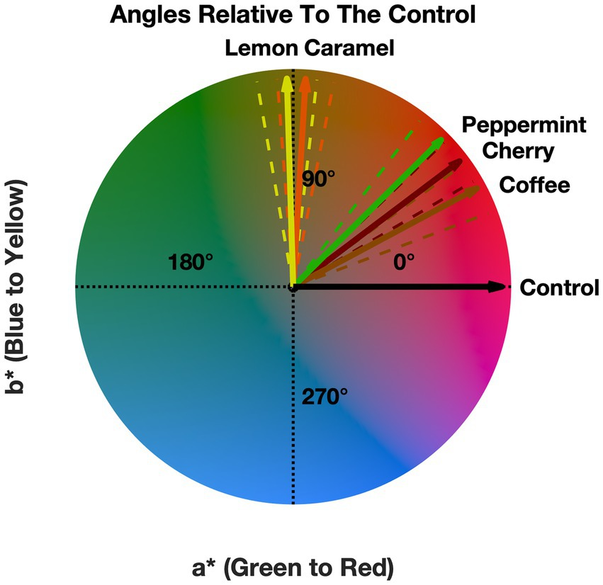
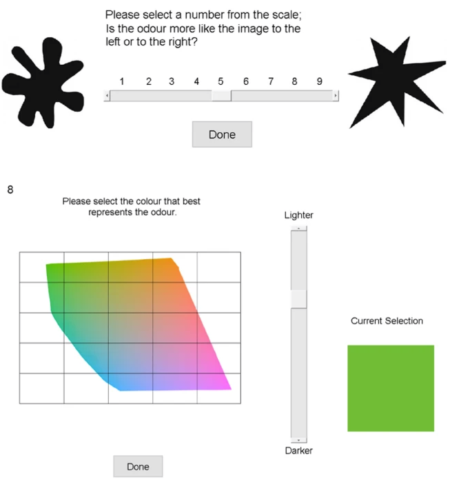
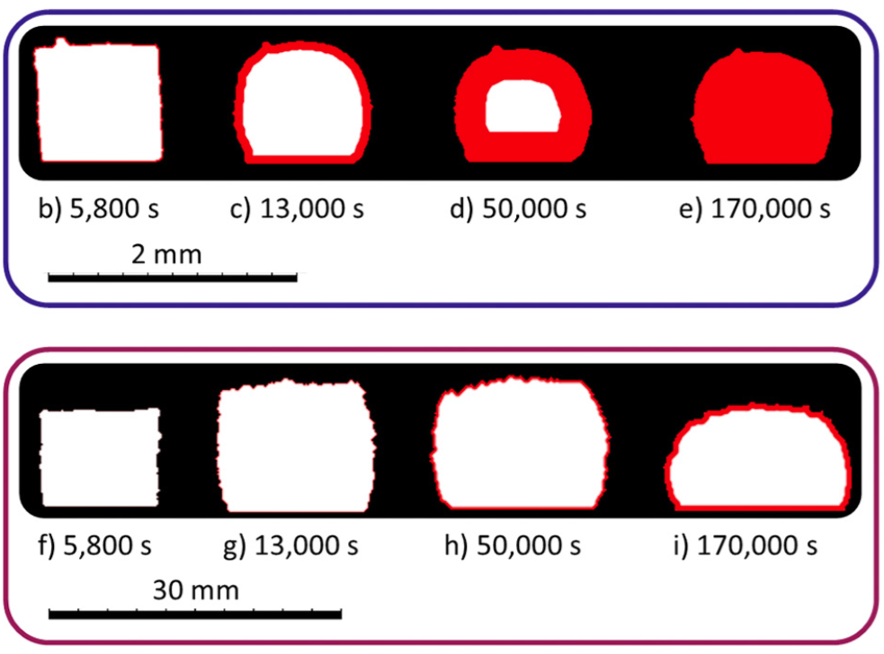

  

      <ul class="nav">  
		  <li><a href="hvs.html">Human contrast vision</a></li>
		  <li><a href="metrics.html">Perceptual visual quality metrics</a></li>
		  <li><a href="colour.html">Colour correction and calibration</a></li>
		  <!-- <li><a href="misc.html">Miscellaneous projects</a></li>-->
      </ul>
  

### miscellaneous projects

    

        

			
		

		

		<b><a href="https://www.frontiersin.org/journals/psychology/articles/10.3389/fpsyg.2023.1175703/full" target="_blank">Odors modulate color appearance</a></b> 
		Ryan J. Ward, Maliha Ashraf, Sophie Wuerger, Alan Marshall 
		<i>Frontiers in Psychology (2023)</i>
		<a href="citations/ward2023odors.txt" target="_blank"><i class="fa-solid fa-quote-right" style="font-size:16px; margin-left: 10px;"></i></a>
		  		
           Our brain constantly combines multisensory information from our surrounding environment. Odors for instance are often perceived with visual cues; these sensations interact to form our own subjective experience. This integration process can have a profound impact on the resulting experience and can alter our subjective reality. Crossmodal correspondences are the consistent associations between stimulus features in different sensory modalities. These correspondences are presumed to be bidirectional in nature and have been shown to influence our perception in a variety of different sensory modalities. Vision is dominant in our multisensory perception and can influence how we perceive information in our other senses, including olfaction. We explored the effect that different odors have on human color perception by presenting olfactory stimuli while asking observers to adjust a color patch to be devoid of hue (neutral gray task). We found a shift in the perceived neutral gray point to be biased toward warmer colors. Four out of five of our odors also trend toward their expected crossmodal correspondences. For instance, when asking observers to perform the neutral gray task while presenting the smell of cherry, the perceptually achromatic stimulus was biased toward a red-brown. Using an achromatic adjustment task, we were able to demonstrate a small but systematic effect of the presence of odors on human color perception.  
        
 
	
 

    

        

			
		

		

		<b><a href="https://www.nature.com/articles/s41598-023-37770-1#:~:text=During%20the%20olfactory%20perception%20process,known%20as%20an%20electronic%20nose." target="_blank">Physicochemical features partially explain olfactory crossmodal correspondences</a></b> 
		Ryan J. Ward, Sophie Wuerger, Maliha Ashraf, Alan Marshall 
		<i>Scientific Reports (2023)</i>
		<a href="citations/ward2023physicochemical.txt" target="_blank"><i class="fa-solid fa-quote-right" style="font-size:16px; margin-left: 10px;"></i></a>
		  	
          During the olfactory perception process, our olfactory receptors are thought to recognize specific chemical features. These features may contribute towards explaining our crossmodal perception. The physicochemical features of odors can be extracted using an array of gas sensors, also known as an electronic nose. The present study investigates the role that the physicochemical features of olfactory stimuli play in explaining the nature and origin of olfactory crossmodal correspondences, which is a consistently overlooked aspect of prior work. Here, we answer the question of whether the physicochemical features of odors contribute towards explaining olfactory crossmodal correspondences and by how much. We found a similarity of 49% between the perceptual and the physicochemical spaces of our odors. All of our explored crossmodal correspondences namely, the angularity of shapes, smoothness of textures, perceived pleasantness, pitch, and colors have significant predictors for various physicochemical features, including aspects of intensity and odor quality. While it is generally recognized that olfactory perception is strongly shaped by context, experience, and learning, our findings show that a link, albeit small (6–23%), exists between olfactory crossmodal correspondences and their underlying physicochemical features.  
        
 
	
 

    

        

			
		

		

		<b><a href="https://www.sciencedirect.com/science/article/abs/pii/S0377027322000816" target="_blank">Vesiculation and densification of pyroclasts: A clast-size dependent competition between bubble growth and diffusive outgassing</a></b> 
		Joshua Weaver, Yan Lavallée, Maliha Ashraf, Jackie E. Kendrick, Anthony Lamur, Jenny Schauroth, Fabian B. Wadsworth 
		<i>Journal of Volcanology and Geothermal Research (2022)</i>
		<a href="citations/weaver2022vesiculation.txt" target="_blank"><i class="fa-solid fa-quote-right" style="font-size:16px; margin-left: 10px;"></i></a>
		  		
          During volcanic eruptions, bubble growth and outgassing determine the porosity, buoyancy, and rheological evolution of magmas, which in turn, dictates the potential for explosive eruption. The processes which lead to magmatic fragmentation have received substantial attention, whereas the subsequent modification of fragmented pyroclasts remains poorly constrained. Here, we present the results of experimentation using obsidian cylinders in the ash to lapilli size range (1–12 mm diameter), for which we find that closed system bubble growth is progressively suppressed by fragment size-dependent, diffusive outgassing. We find that when the volatile partial pressure is lower in the ambient exterior gas than in the melt-hosted bubbles, the volatiles diffusively outgas. This volatile loss produces a bubble-free dehydrated rind, which thickens proportional to the diffusion lengthscale. We show that more outgassing is possible from fragments with higher surface area to volume ratios, and therefore, pyroclasts with a smaller initial radius develop a higher proportion of dehydrated rind, densify faster, and attain more subdued vesicularities. We find that this diffusive outgassing process can produce fully dense, non-vesicular pyroclasts, effectively erasing the textural evidence of the vesiculation event altogether. Using an analytical approximate approach to the evolving clast geometry, we show that current closed system bubble growth models and diffusion models can be combined to estimate vesicularity in pyroclasts surrounded by a free gas of relatively low partial pressure of H2O. Our analyses highlight that a single explosive eruptive episode with disequilibrium volatile partial pressures may produce both dense and vesicular pyroclasts depending on their grain size.  
        
 
	
 

<!-- 

	

		

			
			<b>Retinal illuminance is reduced with age</b>
			
			
			   <b>CSF of older adults match CSF of younger adults at lower luminances</b>
			
		

	

-->